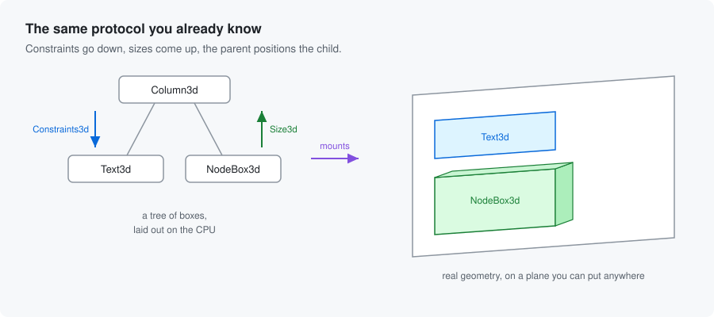
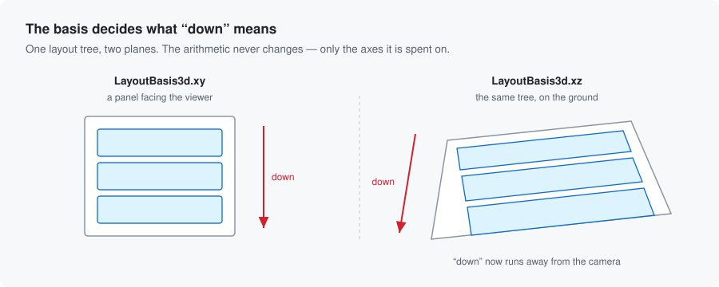
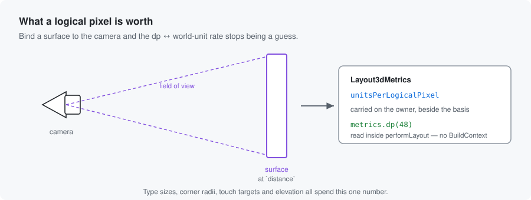

# flutter_scene_layout3d

**Flutter's layout protocol, in a 3D scene.**

You already know how to lay out a Flutter UI: constraints go down, sizes come
up, and the parent decides where the child sits. This project takes those
rules — the actual rules, not an approximation of them — and spends them on
real geometry in a [flutter_scene](https://pub.dev/packages/flutter_scene)
scene.

A `Column3d` is a `Column`. It measures its children, distributes the free
space, and positions them. The difference is that a box has three extents
instead of two, a position is a point in space, and the output of layout is a
tree of scene `Node` transforms rather than a display list.



> **Status: experimental.** The API moves between releases, and the package
> deliberately draws almost nothing on its own yet — see
> [What this does not do](#what-this-does-not-do-yet) before you plan around it.

## Why

Building a panel in a 3D scene usually means one of two bad options. Either you
render a Flutter widget tree to a texture and paste it onto a quad — flat,
blurry when you get close, and unable to have anything stand out of it — or you
place every element by hand with hard-coded coordinates, and then do it again
the moment a label gets longer.

Neither is layout. Layout is the thing that lets a button be as wide as its
text, a row share space between three cards, and a list scroll a thousand items
without you computing a single offset. That machinery is very good, very well
understood, and there is no reason it has to stop being useful the moment the
surface it arranges is a plane in a scene rather than a rectangle on a screen.

So this is the machinery, ported faithfully, arranging cubes and meshes and
glTF models instead of paint operations.

## A first surface

Everything hangs off a `Layout3dSurface`. Give it constraints and a child tree,
add its `plane` to the scene, and flush:

```dart
final surface = Layout3dSurface(
  constraints: Constraints3d.tight(const Size3d(4, 3, 0.5)),
  child: Column3d(
    mainAxisAlignment: MainAxisAlignment3d.center,
    spacing: 0.2,
    children: [
      NodeBox3d(content: Node(mesh: Mesh(cubeGeometry, material))),
      NodeBox3d(content: await loadScene('assets/lamp.glb')),
    ],
  ),
);

scene.root.add(surface.plane);
surface.flush();
```

`NodeBox3d` is the bridge: it takes any scene `Node`, measures its actual
bounds, and hands that size up the tree like any other box. A model that is
0.8 units wide participates in a `Row3d` exactly the way a `Text` participates
in a `Row`.

Because everything laid out hangs below one node, moving that node carries the
whole arrangement:

```dart
surface.plane.rotation = Quaternion.axisAngle(Vector3(0, 1, 0), 0.4);
```

The layout does not re-run. It does not need to — the arrangement is already
correct in its own space, and the plane is what puts that space in the world.

## Down is wherever you point it

A layout does its arithmetic in **layout space**: `x` right, `y` down, `z` away
from the viewer. The *basis* is what maps that onto the scene, and it is the
one genuinely 3D idea you have to hold.



```dart
Layout3dSurface(basis: LayoutBasis3d.xy, ...);  // a panel facing the viewer
Layout3dSurface(basis: LayoutBasis3d.xz, ...);  // the same tree, on the ground
```

The arithmetic is identical. A `Column3d` still stacks along layout's `y`. What
changes is where `y` points: on the ground plane, "down the column" walks
toward the viewer, so the same code that builds a menu builds a row of tiles
laid out on a table. This is why the protocol was worth porting rather than
reinventing — the hard part was always the measuring and the space
distribution, and none of that cares which way is down.

## What a logical pixel is worth

Material says a touch target is 48dp and body text is 14sp. In a scene, those
numbers mean nothing until something says how many world units a logical pixel
is. Guessing a constant works until the camera moves.

Bind a surface to the camera and the number stops being a guess — it is
*derived* from the frustum at the distance the surface sits:



```dart
SceneLayout3d(
  camera: camera,
  binding: const Layout3dCameraBinding.screenFilling(distance: 6),
  child: ...,
);
```

From then on `metrics.dp(48)` and `metrics.sp(14)` are honest, and every box
reads them the same way — inside `performLayout`, with no `BuildContext` and no
inherited widget, so the imperative layer has them too:

```dart
@override
void performLayout() {
  final minimum = metrics.dp(48);   // 48 logical pixels, in world units
  ...
}
```

Writing metrics relayouts the whole subtree, deliberately. It belongs to a
window resize, never to a per-frame path.

## The declarative layer

There is a widget layer over all of it, so a surface can be described the way
you describe a Flutter screen, rebuilt with `setState`, and scrolled with a
controller:

```dart
SceneLayout3d(
  camera: camera,
  child: SceneListView3d.builder(
    itemCount: products.length,
    itemBuilder: (context, i) => SceneSizedBox3d(
      height: 0.6,
      child: SceneNodeBox3d(content: products[i].model),
    ),
  ),
)
```

Items are built on demand, exactly as `ListView.builder` does it: only what is
in the window and its cache extent exists, and scrolling flings with real
physics.

## What is in the box

The protocol is essentially complete. Constraints, intrinsics and baselines;
`Row3d`, `Column3d`, `Stack3d`, `Wrap3d`, `Table3d`, `Flow3d`,
`CustomMultiChildLayout3d` and `LayoutBuilder3d`; the full sliver protocol with
`CustomScrollView3d`, lazy lists and grids, and persistent headers that pin and
float; text measurement that matches Skia's line breaking exactly; decoration
with corners, borders, elevation and state layers; plane clipping; ray-based
hit testing with real gesture recognition, hover and focus traversal; overlays,
modal barriers and a route stack; tweens, implicit animation and scroll
physics; and a diagnostics layer with tree dumps, overflow reporting and debug
wireframes.

The [package README](packages/flutter_scene_layout3d/README.md) is the deep
reference for all of it — it goes box by box, and it is honest about where this
differs from Flutter and why. [docs/](docs/) maps everything else, and
[docs/traps.md](docs/traps.md) is the list of sharp edges worth reading before
you build a component.

## What this does not do yet

**It arranges; it mostly does not draw.** This is the one thing to understand
before planning around the package.

`BoxDecoration3d` has a real shader shipped with it and `Text3d` measures text
exactly, but the painter that turns a decoration into geometry and the glyph
atlas that turns a text layout into quads are both *seams* with no in-tree
implementation. The reason is honest rather than tidy: neither can be verified
in `flutter test`, which has no GPU context, and shipping several hundred lines
that nothing in the repository can execute would be worse than shipping the
seam. Today the debug wireframe is the only thing that puts geometry into a
scene on its own account.

So: the arithmetic is trustworthy and well covered by tests. The pixels are
your side of the seam, for now — though `examples/render_probe` now draws real
geometry on a GPU and checks the frame against the layout, and it is what
compiles the panel shader, so the seam is a shorter reach than it was.

Also open, each for a stated reason: keep-alive for lazily built children,
subtree opacity — `flutter_scene` has no per-node opacity for a fade to
multiply into — and shadows for decorated panels, which the engine will not
cast at all while the panel shader blends its own anti-aliased outline.

## Where this is going

The reason the package exists is **`flutter_scene_material3d`**: a Material
catalogue — `Button3d`, `Card3d`, `Icon3d`, `ListTile3d`, `Scaffold3d`,
`AppBar3d` — built as real geometry on this protocol, with a button that is an
actual object you can light, tilt and press into the panel rather than a
picture of one. When it starts, it lives in this repository as a second
package.

Its
[plan](packages/flutter_scene_material3d/plans/2026_09_01_flutter_scene_material3d.md)
opened with four things missing from *this* package that a first component
could not do without: the declarative layer could not draw, a label had no
default renderer, there was nowhere tree-wide to put a theme, and compiling
the panel shader was an application's job. All four
[have landed](packages/flutter_scene_layout3d/plans/2026_09_01_the_four_things_before_a_component.md)
— `SceneDecoratedBox3d`, `DefaultTextRenderer3d`, `Layout3dSlot`, and a build
hook on this package that compiles its own shader for every consumer — so what
is left is the catalogue itself.

## Running it

```sh
flutter pub get                                     # resolves the workspace
cd packages/flutter_scene_layout3d && flutter test   # the suite
```

The suite is arithmetic and runs headless. To check that a frame actually comes
out, `examples/render_probe` draws the layout on a GPU and probes the result at
the pixels layout says to check:

```sh
cd examples/render_probe
flutter drive --driver=test_driver/integration_test.dart \
  --target=integration_test/render_test.dart -d macos --enable-flutter-gpu
```

The example app commits no platform scaffolding, so generate a platform first:

```sh
cd examples/layout3d_gallery
flutter create . --platforms=macos
flutter run -d macos --enable-flutter-gpu
```

It shows three surfaces at once: an upright panel driven imperatively and
turning on its axis, the same protocol on the ground plane, and a scrolling
list described declaratively — all three hit-testable while the panel beside
them turns.

## Relationship to flutter_scene

`flutter_scene` is the engine underneath, and a plain pub dependency. This
repository does not fork it and does not patch it. The package started life
inside a fork of the engine's monorepo, which is where its early history comes
from, and moved out once the scope made it clear this was its own project.

Contributions and conventions are documented in [AGENTS.md](AGENTS.md), which
is written for coding agents but is the most direct description of how work is
done here. [docs/README.md](docs/README.md) is the map of everything written
down in this repository, including where past decisions and their reasoning
are recorded.
